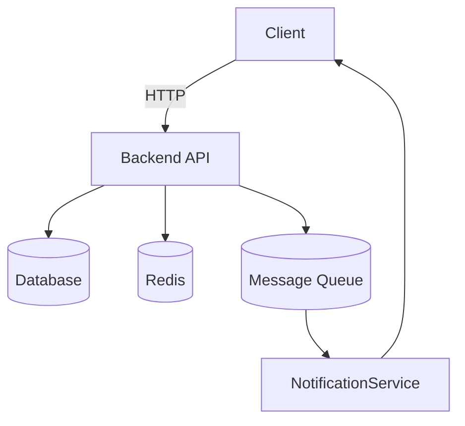

# How to Become a Full Stack Web Developer

## 1. Introduction

A **Full Stack Web Developer** is a versatile professional capable of building both the **frontend** (what users see) and the **backend** (server-side logic, database operations) of a web application.

**Why is Full Stack Development Important?**

- Businesses increasingly prefer **end-to-end developers** who can work across the entire tech stack.
- It **reduces communication overhead** between frontend and backend teams.
- Enables rapid **prototyping and product iteration**.

**Career Opportunities:**

- Full Stack Developer
- Software Engineer
- Technical Lead / Architect
- Freelance Developer or Entrepreneur

> 💡 **Note:** The demand for full stack developers has grown steadily, with competitive salaries and remote work opportunities.

---

## 2. Frontend Development

### Overview

Frontend development involves creating the **user interface (UI)** and **user experience (UX)**. It’s what the user sees and interacts with in their browser.

### Core Skills & Technologies

- **HTML5**: Structure and semantics.
- **CSS3**: Styling and layouts (Flexbox, Grid).
- **JavaScript (ES6+)**: Interactivity and logic.
- **Responsive Design**: Media queries, mobile-first design.
- **Frameworks/Libraries**: React, Vue, Angular.
- **State Management**: Redux, Zustand, Vuex.
- **Best Practices**: Accessibility (WCAG), performance optimization, SEO basics.

### Code Example – Responsive React Component

```jsx
import React from "react";

export default function HeroSection() {
  return (
    <section className="flex flex-col items-center justify-center p-8 bg-gray-900 text-white min-h-screen">
      <h1 className="text-4xl font-bold mb-4">
        Welcome to Full Stack Learning
      </h1>
      <p className="text-lg text-gray-300 max-w-xl text-center">
        Build stunning web apps from scratch with modern tools and frameworks.
      </p>
      <button className="mt-6 px-6 py-3 bg-blue-600 rounded-lg hover:bg-blue-700 transition">
        Get Started
      </button>
    </section>
  );
}
```

### Learning Roadmap

1. **Beginner**: HTML, CSS, JavaScript basics.
2. **Intermediate**: React/Vue/Angular, routing, state management.
3. **Advanced**: Performance optimization, testing (Jest, Cypress), accessibility.

---

## 3. Backend Development

### Overview

Backend development handles **data processing**, **business logic**, and **communication with databases** or external APIs.

### Core Skills & Technologies

- **Languages**: Node.js, Python, Java, Go.
- **Frameworks**: Express.js, Django, Spring Boot.
- **APIs**: REST, GraphQL.
- **Auth**: JWT, OAuth2.
- **Databases**:
  - SQL: PostgreSQL, MySQL
  - NoSQL: MongoDB
- **Best Practices**: Security (OWASP), performance tuning, API versioning.

### Code Example – Express.js API Route

```js
import express from "express";
import { Pool } from "pg";

const app = express();
const pool = new Pool({ connectionString: process.env.DATABASE_URL });

app.get("/users", async (req, res) => {
  try {
    const result = await pool.query("SELECT * FROM users");
    res.json(result.rows);
  } catch (err) {
    res.status(500).json({ error: err.message });
  }
});

app.listen(3000, () => console.log("Server running on port 3000"));
```

### Learning Roadmap

1. **Fundamentals**: HTTP, CRUD operations
2. **APIs**: REST/GraphQL, authentication, authorization
3. **Advanced**: Scaling, caching, background jobs

---

## 4. DevOps & Deployment

### Overview

DevOps is the bridge between **development** and **operations** — ensuring code moves smoothly from development to production.

### Core Skills & Tools

- **CI/CD**: GitHub Actions, GitLab CI, Jenkins
- **Containerization**: Docker
- **Orchestration**: Kubernetes
- **Cloud Platforms**: AWS, Azure, GCP
- **Serverless**: Vercel, Netlify, AWS Lambda
- **Monitoring**: Prometheus, Grafana
- **Best Practices**: IaC (Terraform), automated testing, rollback strategies

### Example – Deploying a MERN App to Vercel

1. Push your code to GitHub
2. Connect the repo to Vercel
3. Configure environment variables in Vercel dashboard
4. Deploy — your app is live in minutes

---

## 5. System Design for Full Stack Developers

### Overview

System design ensures your application is **scalable, maintainable, and efficient**.

### Core Concepts

- **Scalability**: Vertical vs horizontal scaling
- **Load Balancing**: Nginx, HAProxy
- **Database Design**: Normalization, indexing
- **Caching**: Redis, CDN
- **API Design**: REST vs GraphQL
- **Architecture**: Monolith vs microservices
- **Messaging**: RabbitMQ, Kafka

### Example – Social Media Platform Architecture

**Features:**

- Users
- Posts
- Comments
- Likes
- Notifications



## Best Practices

- Plan for failover
- Secure APIs with rate limiting
- Monitor distributed services

---

## 6. Additional Resources & Learning Path

### 📚 Books

- _You Don’t Know JS_ — Kyle Simpson
- _Clean Code_ — Robert C. Martin

### 🎓 Courses

- [freeCodeCamp](https://www.freecodecamp.org/)
- [The Odin Project](https://www.theodinproject.com/)
- [CS50 by Harvard](https://cs50.harvard.edu/)

### 🛠 Practice Platforms

- [Frontend Mentor](https://www.frontendmentor.io/)
- [LeetCode](https://leetcode.com/)
- [Codewars](https://www.codewars.com/)

### 💼 Portfolio Tips

- Showcase **3–5 high-quality projects**
- Use [GitHub](https://github.com/) for version control
- Deploy live demos for recruiters

---

> 🚀 **Final Motivation:** Becoming a full stack developer is a journey.  
> Take it one step at a time, practice consistently, and build real-world projects.  
> The more you create, the faster you’ll master the craft.
